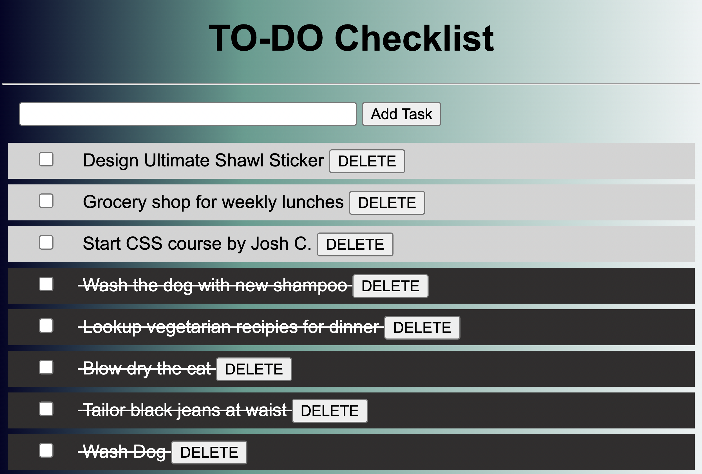

# To-Do List 

## Description

Duration: 4 hours

I created a 'To-Do List' fullstack application. This application has a few different functions. You can add new tasks to the list by entering an input into the text box provided. This will take task, enter it into the database, and add it to the list of tasks you have already created. When you complete a task, just click the checkbox and the application will mark the task as complete in the database and visually represent a completed task by drawing a line through the text. If you find you no longer need to complete a task, you can hit the delete button and it will be removed from the database. 

## Screen Shot 

 

## Prerequisites 

[Node.js](https://nodejs.org/en/)
[Postico](https://eggerapps.at/postico2/)
[PostgreSQL](https://www.postgresql.org/)

## Installation 

1. This project is built with Node.js, Postgres, and Postico so you will need to make sure to have them installed (links above if needed). I recommend using Postico because that is what I used to create the queries. 
2. Create a database named 'weekend_to_do_app'.
Once in the database, the queries in the database.sql file are set up to create all the necessary tables and populate the needed data to allow the application to run correctly. Alternatively, you can use the application to enter your own tasks.
3. Open file in an editior of your choice. This one was built with VS Code. 
4. Go to this file in your terminal. When there, run the following commands: 
  1. `npm init --yes`
  2. `npm install`
  3. `npm start`
This will install the dependencies you need to run the program and should start your local host. 

## Built With 

- Javascript 
- Node.js 
- Express 
- BodyParser 
- PostgreSQL

